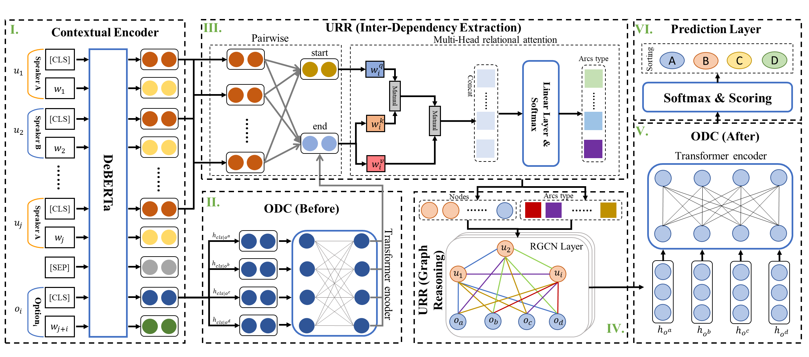

# IRRGN: An Implicit Relational Reasoning Graph Network for Multi-turn Response Selection
## Overview of the proposed IRRGN

## jupyter_version
jupyter_version is an unofficial version of the code, but you can use it to load model weights to verify the effect in the paper.
## Code
You can train the model as follows:
 ```
    python code/main.py 
 ```
## Checkpoints
Checkpoints on the base and plus datasets can be obtained through this [link](https://drive.google.com/drive/folders/143Qj9pM6Lc0Bft3NvJbgjqBwdV3aYN9c?usp=sharing).
## Environment

* A100-SXM4-80GB GPU

* CUDA 11.3

## Citation

	@inproceedings{DBLP:conf/emnlp/DengDGJP22,
	  author       = {Jingcheng Deng and
	                  Hengwei Dai and
	                  Xuewei Guo and
	                  Yuanchen Ju and
	                  Wei Peng},
	  editor       = {Yoav Goldberg and
	                  Zornitsa Kozareva and
	                  Yue Zhang},
	  title        = {{IRRGN:} An Implicit Relational Reasoning Graph Network for Multi-turn
	                  Response Selection},
	  booktitle    = {Proceedings of the 2022 Conference on Empirical Methods in Natural
	                  Language Processing, {EMNLP} 2022, Abu Dhabi, United Arab Emirates,
	                  December 7-11, 2022},
	  pages        = {8529--8541},
	  publisher    = {Association for Computational Linguistics},
	  year         = {2022},
	  url          = {https://doi.org/10.18653/v1/2022.emnlp-main.584},
	  doi          = {10.18653/v1/2022.emnlp-main.584},
	  timestamp    = {Thu, 10 Aug 2023 12:35:22 +0200},
	  biburl       = {https://dblp.org/rec/conf/emnlp/DengDGJP22.bib},
	  bibsource    = {dblp computer science bibliography, https://dblp.org}
	}
